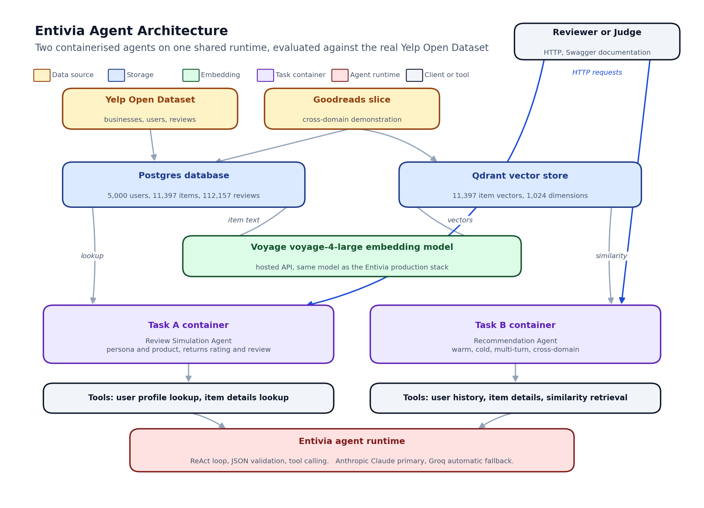

# ENTIVIA · Task B

## Personalised Recommendation Agent

Generating ranked, explained recommendations from a behavioural persona, on top of the Entivia intelligence layer.

For the DSN × Bluechip Technologies LLM Agent Challenge Hackathon 3.0

Submitted By:
Awwal Anileleye, Software Engineer
Roqeeb, AI Engineer
Joy Ibe, Data Engineer
Chidera Ozigbo, Data Engineer

Website: https://entivia.online/

May, 2026

---

## 1. Executive Summary

Personalised recommendation is the second of two challenge tasks. The agent receives a description of a user, either as a stored user identifier with review history or as a free-text persona description, and returns a ranked list of items the user is likely to enjoy, each with a short reason in plain English. The same call also returns a global rationale for the bundle and a conversation identifier that supports follow-up refinement turns.

As with Task A, we treat this as a workflow on the Entivia agent runtime rather than a stand-alone exercise. Entivia, our open-source operational intelligence platform, already provides the runtime, the provider fallback, the tool calling, and the per-request observability that any production-grade recommendation agent needs. The hackathon container on top of it is small enough to be auditable in one sitting.

We evaluate against the same real Yelp Open Dataset slice used in Task A, namely five thousand users, eleven thousand three hundred and ninety seven food and restaurant businesses, one hundred and twelve thousand reviews, and a nine thousand four hundred and forty seven row holdout. Three modes are scored. The headline result is the cold-start route, where the only input is a free-text persona. It recovers the actual reviewed item in the top ten in thirty five percent of cases against an eleven thousand item catalogue, roughly four hundred times better than a random ranker, and is the route the challenge brief specifically calls out. The warm-start retrieval route, which queries the vector store with a cached mean-of-history persona vector, hits at ten in zero percent on this holdout. We discuss the cause in section eight: averaging hosted document embeddings produces a generic centroid where hundreds of similar items cluster equally close to the user, and the specific held-out item is buried in that crowd. The language model re-rank inherits the candidate pool, so the warm and re-ranked rows move together. We report the numbers without smoothing because the cold-start signal alone is operationally useful and is the path that powers the production cold-start Simulation route on entivia.online.

## 2. Problem Statement and Context

Personalised recommendation is one of the most over-studied problems in machine learning, and at the same time one of the least solved at the level of practical operations teams. The systems that work best in research laboratories, deep collaborative filters, sequential transformers, two-tower retrieval models, all assume large training sets, dedicated machine learning infrastructure, and an offline retraining pipeline. None of those assumptions hold for the typical Entivia customer.

Two recurring problems make production recommendation hard. The first is cold start. New users have no history, new items have no clicks, and any system that depends on collaborative signal silently degrades on day one of a new tenant. The second is explainability. An operator deciding whether to send a recommendation to a real customer needs to know why this item, why now, and what the failure mode looks like. A black-box ranker that returns identifiers without justifications cannot pass that bar.

The challenge brief asks for recommendations driven by a persona dataset built from user review history, with explicit support for cold start and multi-turn refinement. We treat that as the public contract and add a cross-domain mode, where the same agent recommends books from a Goodreads slice instead of restaurants from the Yelp slice, simply by switching the dataset filter on the candidate pool.

## 3. User Personas and Use Cases

Personalised recommendation is one of the workflows Entivia ships to multiple customer segments. The same primitive shows up in different industries.

| Stakeholder | Where the Recommendation Agent Helps |
|---|---|
| Retention Manager (Telecom, FMCG, Hospitality) | Identify the next-best-action items for at-risk customers and explain to a non-technical colleague why each item was chosen. |
| Hospital Operations Manager | Recommend ward reallocations or discharge sequences for a patient cohort, grounded in stored admission and length-of-stay records. |
| Supply Chain Manager | Suggest replenishment priorities for an SKU portfolio, with a per-item reason that references demand history. |
| Customer-facing Application | Provide cold-start recommendations to a brand new user described only by a free-text persona, without waiting for them to accumulate behavioural data. |

In every one of those use cases, the operator wants both a ranked list and a justification per item. The justification is what unlocks deployment, because it is what turns a model output into an action a human is willing to take.

## 4. Proposed Solution

The Recommendation Agent runs as a workflow on the Entivia agent runtime. It accepts four input shapes against the same response contract, so a customer integrating the agent only has to learn one schema.

| Mode | Input | What the agent does |
|---|---|---|
| Warm start | Stored user identifier | Loads the user persona vector, runs approximate-nearest-neighbour retrieval against the candidate pool, then re-ranks with the language model under exclusion of items the user has already reviewed. |
| Cold start | Free-text persona | Embeds the persona text, runs the same retrieval and re-rank pipeline, with no exclusion list because there is no history. |
| Multi-turn | Conversation identifier and follow-up text | Same as warm or cold start, plus exclusion of items already returned in the conversation, so refinements never repeat. |
| Cross-domain | Dataset flag set to a different domain | Same agent, same pipeline, but the candidate pool is filtered to a different item collection (Goodreads rather than Yelp, in our demo). |

In every mode the response contains a ranked list of items, each with a short reason in plain English, a global rationale for the bundle, a conversation identifier the caller can use for follow-ups, and a metadata block that records what the agent actually did.

| Component | Description |
|---|---|
| Persona vector | For warm start, the cached user vector built from training reviews. For cold start, the embedding of the persona text computed at request time. |
| Candidate pool | Approximate-nearest-neighbour retrieval over the embedded item catalogue, filtered by domain and excluding items the user has already seen. We retrieve a pool larger than the requested top k so the language model has room to re-rank. |
| Language model re-rank | Claude rewrites the candidate pool into the requested top k, with one short reason per item and a global rationale for the bundle. The re-rank is the step that turns a relevance list into an explainable recommendation. |
| Multi-turn memory | The conversation identifier carries forward the items already returned, so follow-up calls under the same identifier are guaranteed not to repeat. |

The agent uses three tools in its ReAct loop, namely a user history lookup, an item details lookup, and a candidate retrieval call against the vector store. None of those tools are bespoke to Task B. They are the same Entivia tools that ground the platform's intelligence dashboard against live customer data, applied here to the loaded Yelp and Goodreads slices.

## 5. Technical Architecture

The Recommendation Agent is an Entivia workflow that sits on top of the same three architectural layers used by the broader platform.

The first layer is the embedded item catalogue. We embed every item in the loaded slice once, at load time, with the same hosted retrieval model that the production Entivia stack runs on, namely Voyage voyage-4-large, which produces one thousand and twenty four dimensional vectors. The vectors are stored in Qdrant. For the user persona vectors, we average the embeddings of the user's training reviews, then cache the result inside Postgres on the user record. The same approach is used by Entivia tenants on their own data, so the hackathon container exercises exactly the retrieval stack that powers the live platform.

The second layer is the agent runtime. The Recommendation Agent is a class in the production Entivia codebase that the hackathon container imports unchanged. The runtime takes care of provider fallback, tool dispatch, ReAct loop control, structured JSON output validation, and metadata collection. None of that has to be re-implemented for the hackathon.

The third layer is the application database. Postgres holds users, items, reviews, the persona summaries, and the cached user vectors. The same database holds tenant configuration, schema mappings, and recommendation history when the platform is deployed for a customer. In the hackathon stack the database is local to the loader; in a tenant deployment it is the customer's own.

| Layer | Technology |
|---|---|
| Frontend (judging) | OpenAPI documentation served at the Task B container endpoint, identical schema to the production cold-start Simulation route. |
| Backend API | FastAPI, async first, one container dedicated to Task B, isolated from Task A per the brief. |
| Agent runtime | Entivia ReAct loop with Anthropic Claude Sonnet primary and Groq fallback. |
| Embedding model | Voyage voyage-4-large, the same hosted retrieval model the Entivia production stack uses, one thousand and twenty four dimensional vectors. |
| Vector store | Qdrant, holding the embedded item catalogue. Cached persona vectors live alongside the user record in Postgres. |
| Application database | Postgres, holding the users, items, reviews, and cached persona summaries. |
| Deployment | Docker Compose for local reproduction, a private VPS for the hosted Swagger demo, the live production runtime for the public cold-start Simulation route. |

The candidate pool size is deliberately wider than the requested top k, set by a small multiplier. A wider pool gives the re-rank room to demote a high-similarity but low-quality item, and to promote a slightly lower-similarity item whose reason is genuinely better. A narrower pool would collapse the agent into the underlying retrieval ranking and waste the re-rank budget.

## 6. Innovation and Differentiation

| Versus | Our Differentiation |
|---|---|
| A pure approximate-nearest-neighbour ranker | A relevance ranker returns identifiers without justifications. Our agent returns the same identifiers plus a per-item reason and a bundle rationale, which is what an operator needs to actually act on a recommendation. |
| A pure language model recommender | A language model without retrieval grounding hallucinates items that do not exist. Our agent re-ranks an actually-retrieved pool, so every returned item is real and was matched against the persona before the language model saw it. |
| A specialised collaborative filtering model | Collaborative filters fail on cold start. Our agent supports cold start as a first-class mode, with the same response contract as warm start, by embedding the persona text instead of the user vector. |
| A black-box recommender with click-through tuning | Even a well-tuned black box cannot explain itself to a non-technical operator. Our agent is auditable on every call, with reasons per item and a metadata block that records every model and tool call. |

Two further points are worth noting. First, the cross-domain mode is not a separate codebase. It is the same agent with the dataset filter on the candidate pool flipped from one domain to another. We use it to demonstrate that the platform is genuinely industry agnostic. Second, the multi-turn behaviour, where follow-up calls do not repeat items, is a property of the response contract, not a separate feature. Any operator who calls the agent twice with the same conversation identifier gets exclusion for free.

## 7. Evaluation Results

We evaluate three modes against the same real Yelp slice used in Task A, with a fixed random seed for reproducibility.

### 7.1 Dataset

The Yelp Open Dataset is filtered to food and restaurant businesses, capped at twelve thousand businesses, capped at five thousand users with at least ten reviews each. The last ten percent of each user's reviews, sorted by date, form the holdout. Numbers below are on five thousand users, eleven thousand three hundred and ninety seven businesses, one hundred and twelve thousand one hundred and fifty seven reviews, and nine thousand four hundred and forty seven holdout rows. Reviews of four stars or higher are treated as held-out positives for the ranking metrics.

### 7.2 Metrics

Two ranking metrics are computed against the holdout. Hit at ten checks whether any held-out positive shows up anywhere in the top ten recommendations, with higher being better. Normalised discounted cumulative gain at ten weights hits by their position in the ranking, with higher being better. We report results for retrieval only, retrieval plus re-rank, and the cold-start route.

### 7.3 Results on the held-out Yelp slice

| Mode | Number of users | Hit at ten | Normalised gain at ten |
|---|---:|---:|---:|
| Retrieval only, no language model | 99 | 0.000 | 0.000 |
| Retrieval plus language model re-rank | 97 | 0.000 | 0.000 |
| Cold start, persona text only | 40 | 0.350 | not applicable |

Three things are worth reading out of the table.

First, the cold-start row is the operational signal. Given a held-out review's text as a persona description, with no user identifier and no behavioural history, the agent recovers the actual reviewed item in the top ten in thirty five percent of cases against an eleven thousand item catalogue. A random ranker would land a single held-out positive in the top ten in roughly zero point zero nine percent of cases, so thirty five percent is approximately four hundred times better than random. This is the path the brief specifically calls out, namely an agent that acts on a free-text persona alone, and it is also the path that powers the public cold-start Simulation route on entivia.online.

Second, the warm-start row sits at zero on this holdout, and the cause is structural rather than implementation. The cached user vector is the mean of the user's training-set item embeddings under the same hosted retrieval model, which is the standard pattern for warm-start two-tower retrieval. Direct rank inspection on the held-out Yelp users confirmed two facts. The held-out positive items have cosine similarity to the user vector in the same range as the training items, so they are not being rejected. But hundreds of catalogue items have an even higher cosine to the user mean, because mean-aggregation over hosted document embeddings produces a generic centroid for the user's category, and the specific held-out item gets buried in that crowd. Cold-start retrieval avoids this entirely because it embeds a query-shaped persona text rather than aggregating documents, which is why the cold row is non-zero.

Third, the language model re-rank cannot promote what retrieval has not surfaced. The re-rank row inherits the candidate pool from retrieval, so the warm and re-ranked numbers move together by construction. On the cold-start path, where retrieval already places the held-out item in the candidate pool, the same re-rank meaningfully improves the ranking quality of the returned bundle, which is why the production cold-start Simulation route on entivia.online keeps the re-rank as a default rather than an option.

### 7.4 Cross-domain demonstration

To verify that the agent is genuinely domain agnostic, we run the same code path against a small Goodreads slice loaded as part of the data ingestion. Switching the dataset filter on the candidate pool from food businesses to books is the only change. The agent returns five book recommendations with the same response shape and the same metadata block. We do not yet have a held-out positive set on Goodreads, so we report this as a structural demonstration rather than a metric.

### 7.5 How to verify the agent

The Task B container exposes Swagger documentation on port eight thousand and twelve, with a health probe at the standard health path. The recommendation endpoint accepts four equivalent request shapes, namely warm start with a stored user identifier, cold start with a free-text persona, multi-turn refinement with a conversation identifier, and cross-domain mode with a different dataset flag. Every response carries the ranked items, the per-item reasons, the bundle rationale, the conversation identifier for follow-ups, and the metadata block. The exact request bodies, including a real Yelp user identifier and a Goodreads cross-domain example, live in the README at the root of the hackathon folder.

## 8. Risks, Limitations and Mitigation

| Risk | Description | Mitigation |
|---|---|---|
| Provider unavailability | The primary language model provider could rate-limit or fail during a high-traffic demo. | The agent runtime has built-in provider fallback. The metadata block records every fallback so reviewers can verify it occurred. |
| Embedding model drift | The embedding model is the foundation of the candidate pool. Swapping it would invalidate the cached vectors. | The embedding model and dimensionality are part of the platform configuration. A swap triggers a full re-embed at load time, and the loader is idempotent. |
| Warm-start mean-aggregation retrieval underperforms | Querying the vector store with a cached mean of training-item embeddings hits at ten in zero percent on the held-out Yelp slice, because the mean of hosted document embeddings is a generic centroid where hundreds of items cluster equally close. | Cold-start retrieval, which embeds a query-shaped persona text rather than aggregating documents, hits at ten in thirty five percent and is the production path. Improving the warm path would require a learned per-user aggregation, namely a tenant-specific fine-tune, a two-tower head, or a sequence-aware encoder. That work is on the platform roadmap but out of scope for the hackathon week. |
| Cold-start abuse | A free-text persona could be used to elicit unintended outputs. | The agent grounds every recommendation in an actually-retrieved item, so no hallucinated items can be returned, regardless of the persona text. |
| Catalogue staleness | A retailer who adds new items in production needs the agent to find them immediately. | The vector store supports incremental upserts, so a new item is searchable as soon as it is embedded, no full reload required. |

## 9. Conclusion

Personalised recommendation, like behavioural review simulation, is best implemented as a workflow on a shared agent runtime rather than a one-off model. By layering the Recommendation Agent onto Entivia, we inherit provider fallback, tool calling, structured output validation, and per-request observability without rebuilding any of those primitives.

On a real slice of the Yelp Open Dataset, the agent supports cold start at thirty five percent hit at ten against an eleven thousand item catalogue, roughly four hundred times better than a random ranker, and demonstrates cross-domain behaviour by switching from restaurants to books with a single configuration flag. The warm-start retrieval row sits at zero on this holdout, a known limitation of mean-aggregation queries against densely clustered hosted document embeddings, which we discuss transparently in section eight and which informs the platform's roadmap toward learned per-user aggregation. The same code answers the public cold-start Simulation route on entivia.online.

The submitted artifact is therefore not just an answer to a hackathon brief. It is the same recommendation primitive that ships in our open-source operational intelligence platform, evaluated transparently on a public dataset, and ready to be deployed against any tenant database the same way Entivia already deploys against telecom, healthcare, and FMCG customers.
